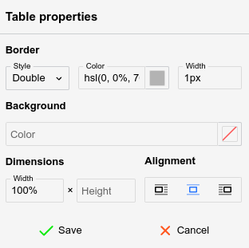
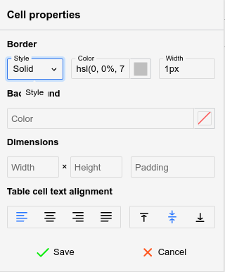

# Tables
Tables are a powerful feature for <a class="reference-link" href="../Text.md">Text</a> notes, since editing them is generally easy.

<figure class="image image-style-align-right"></figure>

To create a table, simply press the table button and select with the mouse the desired amount of columns and rows, as indicated in the adjacent figure.

Since v0.107.0, the same menu starts with an _Insert table…_ item, for a table larger than the grid or to type its size instead:

1.  Click the  button and select _Insert table…_. A small form opens at the cursor.
2.  Enter the number of _Rows_ (up to 1000) and _Columns_ (up to 100). The table can have at most 5000 cells in total, for example 1000 rows of 5 columns.
3.  Press _Insert_ or <kbd>Enter</kbd>.

To close the form without inserting a table, press <kbd>Esc</kbd> or click outside it. From the keyboard, <kbd>Tab</kbd> moves between _Insert table…_ and the grid while the menu is open.

## Formatting toolbar

When a table is selected, a special formatting toolbar will appear:

## Context menu

Since v0.106.0, right-clicking anywhere inside a table opens a context menu with the most common table operations:

*   _Insert row above_ and _Insert row below_ insert a blank row next to the row of the current cell. When the selection spans multiple rows, the same number of rows is inserted.
*   _Insert column to the left_ and _Insert column to the right_ work the same way for columns.
*   Since v0.107.0, _Set as header_ or _Set header up to this row_, depending on the selection, turns rows into header rows, which always start at the top of the table:
    *   _Set as header_ shows when the selection starts at the first row, and makes every selected row a header row.
    *   _Set header up to this row_ shows when the selection is in a single row below the first, and makes that row and every row above it header rows.
    *   Neither shows when the selection spans several rows below the first.
    *   A check mark shows that the rows are already header rows. Choosing the item again turns them, and every header row below them, back into regular rows. For example, in a table with five header rows, choosing _Set header up to this row_ on the third row leaves only the first two as header rows.
*   _Merge cells_ merges the selected cells into one. The selected cells must form a rectangle.
*   _Split cell_ splits each selected cell in two, either _Vertically_ or _Horizontally_. _Unmerge cells_, in the same submenu, turns each merged cell in the selection back into the single cells it covers, keeping its content in the top-left one; cells that are not merged stay as they are.
*   _Distribute columns evenly_ splits the combined width of the columns the selection touches equally between them. The other columns and the width of the table stay as they are. It needs a selection spanning at least two columns; a merged cell counts for every column it covers.
*   _Cut_, _Copy_ and _Copy as Markdown_ act on the selected cells:
    *   Cutting or copying produces a smaller table holding just the selected cells. Pasting it over a cell selection replaces those cells; pasting elsewhere inserts it as a table of its own. Cutting clears the cells without removing rows or columns.
    *   _Copy as Markdown_ converts the selected cells to a Markdown table. A selected header row becomes the Markdown header; without one, an empty header row is emitted, since Markdown tables require one.
*   _Sort_, below the clipboard section, sorts the rows by the column of the current cell, in _Ascending_ or _Descending_ order. See [Sorting rows](#sorting-rows).
*   _Delete row_ and _Delete column_, below _Sort_, remove every row or column the selection touches, even when only some of their cells are selected.
*   _Delete table_ removes the whole table and leaves an empty paragraph in its place. In a table nested inside another, only the inner table is removed.
*   Since v0.107.0, _Select_, below _Delete table_, selects the cells of every row (_Row_) or column (_Column_) the selection touches, or every cell of the table (_Table_). Unlike the  button, which selects the table as a whole, _Table_ selects its cells, so cell operations such as _Merge cells_ apply to all of them. In a table nested inside another, _Table_ selects only the cells of the inner table.

Right-clicking a cell that is not part of the current selection moves the cursor there first, so the menu always applies to the cell under the pointer.

> [!NOTE]
> In the browser, Trilium's menu replaces the browser's own context menu inside tables. To reach the browser's menu (for example for its spell checking suggestions), hold <kbd>Shift</kbd> while right-clicking. The desktop application is unaffected, since its menu already includes the spelling suggestions. In the browser, the menu also offers _Paste_ only when the page can read the clipboard, which requires a secure (HTTPS) context and your permission; otherwise, paste with <kbd>Ctrl</kbd>+<kbd>V</kbd>.

## Navigating a table

*   Using the mouse:
    *   Click on a cell to focus it.
    *   Click the  button at the top or the bottom of a table to insert an empty paragraph near it.
    *   Click the  button at the top-left of the table to select it entirely (for easy copy-pasting or cutting) or drag and drop it to relocate the table.
*   Using the keyboard:
    *   Use the arrow keys on the keyboard to easily navigate between cells.
    *   It's also possible to use <kbd>Tab</kbd> to go to the next cell and Shift+Tab to go to the previous cell.
    *   Unlike arrow keys, pressing <kbd>Tab</kbd> at the end of the table (last row, last column) will create a new row automatically.
    *   To select multiple cells, hold <kbd>Shift</kbd> while using the arrow keys.

## Resizing cells

*   Columns can be resized by hovering the mouse over the border of two adjacent cells and dragging it.
*   To give several columns the same width, select cells across them and choose _Distribute columns evenly_ from the  button of the formatting toolbar or from the [context menu](#context-menu).
*   By default, the row height is not adjustable using the mouse, but it can be configured from the cell settings (see below).
*   To adjust exactly the width (in pixels or percentages) of a cell, select the  button.

## Inserting new rows and new columns

*   To insert a new column, click on a desired location, then press the  button from the formatting toolbar and select _Insert column left or right._
*   To insert a new row, click on a desired location, then press the  button and select _Insert row above_ or _below_.
    *   A quicker alternative to creating a new row while at the end of the table is to press the <kbd>Tab</kbd> key.
*   Both operations are also available in the [context menu](#context-menu), which inserts as many rows or columns as the selection spans.

## Moving rows and columns

Since v0.106.0, rows and columns can be reordered with the keyboard:

*   <kbd>Alt</kbd>+<kbd>Up</kbd> and <kbd>Alt</kbd>+<kbd>Down</kbd> move the rows touched by the selection up or down.
*   <kbd>Alt</kbd>+<kbd>Left</kbd> and <kbd>Alt</kbd>+<kbd>Right</kbd> move the columns touched by the selection left or right.

Merged cells are never split by a move. The rows or columns held together by a merged cell travel as one block, and moving toward such a block jumps over it entirely.

When the table has a header row, a header row moved below the header area becomes a regular row, and a regular row moved into the header area becomes a header row. Header columns behave the same way.

Outside of tables, <kbd>Alt</kbd>+<kbd>Left</kbd> and <kbd>Alt</kbd>+<kbd>Right</kbd> keep navigating the note history, and <kbd>Alt</kbd>+<kbd>Up</kbd> and <kbd>Alt</kbd>+<kbd>Down</kbd> keep moving the current paragraph.

## Sorting rows

Since v0.107.0, the rows of a table can be sorted by the values of one column:

*   To sort all the rows, place the cursor in any cell of the column to sort by, then select _Sort_ → _Ascending_ or _Descending_ from the [context menu](#context-menu). The same items are in the  button of the formatting toolbar.
*   To sort only some of the rows, select their cells in the column to sort by, then sort the same way. Sorting is not available while the selection spans more than one column.

Header rows always stay at the top of the table and are never sorted. A sort can be undone with <kbd>Ctrl</kbd>+<kbd>Z</kbd>.

### How values are compared

Each cell is read as plain text, so formatting does not affect the order. Trilium then detects what kind of value the cell holds:

| Kind | Examples | Compared by |
| --- | --- | --- |
| Time | `15:02`, `15:02:38`, `3:02 PM` | The time of day. |
| Date | `2026-09-30`, `2026-09-30 15:02`, `30 September 2026`, `Wednesday, 30 September 2026`, `2026-09-30T15:02:38+03:00` | The date and time. |
| Number | `12`, `-3.5`, `1,234.56`, `$ 12.04`, `21 RON`, `24.5m` | The numeric value. |
| Text | Anything else. | Alphabetically, ignoring case, with numbers inside the text in numeric order (`Item 9` before `Item 10`). Accents count, so `a` and `á` differ. |
| Empty | An empty cell, or one holding only spaces. | Not compared. Empty cells always go last. |

Ascending order puts times first, then dates, numbers and text. Descending order reverses it. Empty cells go last in both directions.

Numbers, dates and times with the same value are ordered by their text, so `5 apples` comes before `5 pears`. Rows whose cells hold the same text, ignoring case, keep their relative order.

*   Dates are also recognized in the formats of the note's language, such as `30.09.2026` or `30. September 2026` for German, and in the format chosen in <a class="reference-link" href="../../Basic%20Concepts%20and%20Features/UI%20Elements/Options.md">Options</a> → _Text Notes_ → _Editor_ → _Date/time format_ for [inserting the date and time](Insert%20buttons.md).
*   A number can start with a currency symbol, such as `$`, `€` or `£`. Whatever follows the number, such as a unit, is ignored, so units are not converted: `1 km` sorts before `500 m`. A cell that starts with letters, such as `RON 21`, is text.
*   The decimal separator follows the language of the note: `1.500` is one and a half in English, but one thousand five hundred in German. A comma or period that is not followed by exactly three digits is always read as a decimal separator, so `1,5` is one and a half in either language.
*   The language of the note is the one set in its Basic Properties, or else the default content language. See <a class="reference-link" href="Content%20language%20%26%20Right-to-left%20support.md">Content language &amp; Right-to-left support</a>.

### Merged cells

Rows joined by a merged cell are kept together and move as one block. The block is sorted by the value in its first row. When the block has more than one cell in the sorted column, the other cells do not affect the order, and a message says so: _Some rows were sorted together because merged cells tie them to each other_.

When the selection covers only part of such a block, the whole block is sorted.

## Merging cells

To merge two or more cells together, simply select them via drag & drop and press the  button from the formatting toolbar.

More options are available by pressing the arrow next to it:

*   Click on a single cell and select Merge cell up/down/right/left to merge with an adjacent cell.
*   Select _Merge selected cells_ to merge the selected cells, the same as pressing the button itself.
*   Select _Split cell vertically_ or _horizontally_, to split a cell into multiple cells (can also be used to undo a merge).
*   Select _Unmerge cells_ to turn each merged cell in the selection back into the single cells it covers, keeping its content in the top-left one.

_Merge selected cells_ and _Unmerge cells_ are available since v0.107.0. Merging and splitting are also available by right-clicking the selected cells, via the [context menu](#context-menu), where _Unmerge cells_ is in the _Split cell_ submenu.

## Table properties

<figure class="image image-style-align-right"></figure>

The table properties can be accessed via the  button and allows for the following adjustments:

*   Border (not the border of the cells, but the outer rim of the table), which includes the style (single, double), color and width.
*   The background color, with none set by default.
*   The width and height of the table in percentage (must end with `%`) or pixels (must end with `px`).
*   The alignment of the table.
    *   Left or right-aligned, case in which the text will flow next to it.
    *   Centered, case in which text will avoid the table, regardless of the table width.

The table will immediately update to reflect the changes, but the _Save_ button must be pressed for the changes to persist.

## Cell properties

<figure class="image image-style-align-right"></figure>

Similarly to table properties, the  button opens a popup which adjusts the styling of one or more cells (based on the user's selection).

The following options can be adjusted:

*   The border style, color and width (same as table properties), but applying to the current cell only.
*   The background color, with none set by default.
*   The width and height of the cell in percentage (must end with `%`) or pixels (must end with `px`).
*   The padding (the distance of the text compared to the cell's borders).
*   The alignment of the text, both horizontally (left, centered, right, justified) and vertically (top, middle or bottom).

The cell will immediately update to reflect the changes, but the _Save_ button must be pressed for the changes to persist.

## Caption

Press the  button to insert a caption or a text description of the table, which is going to be displayed above the table.

## Table borders

By default, tables will come with a predefined gray border.

To adjust the borders, follow these steps:

1.  Select the table.
2.  In the floating panel, select the _Table properties_ option ().
    1.  Look for the _Border_ section at the top of the newly opened panel.
    2.  This will control the outer borders of the table.
    3.  Select a style for the border. Generally _Single_ is the desirable option.
    4.  Select a color for the border.
    5.  Select a width for the border, expressed in pixels.
3.  Select all the cells of the table and then press the _Cell properties_ option ().
    1.  This will control the inner borders of the table, at cell level.
    2.  Note that it's possible to change the borders individually by selecting one or more cells, case in which it will only change the borders that intersect these cells.
    3.  Repeat the same steps as from step (2).

### Tables with invisible borders

Tables can be set to have invisible borders in order to allow for basic layouts (columns, grids) of text or [images](Images.md) without the distraction of their border:

1.  First insert a table with the desired number of columns and rows.
2.  Select the entire table.
3.  In _Table properties_, set:
    1.  _Style_ to _Single_
    2.  _Color_ to `transparent`
    3.  Width to `1px`.
4.  In Cell Properties, set the same as on the previous step.

## Table indentation

Since v0.104.1, tables can be indented as a block (the whole table moves, rather than just the content of a cell).

1.  Click the  button to select the entire table. Otherwise, the indentation applies only to the current cell's content.
2.  Press <kbd>Tab</kbd> to increase the indent, or <kbd>Shift</kbd>+<kbd>Tab</kbd> to decrease it. Alternatively, use the indentation buttons in the formatting toolbar.

Markdown does not support indented tables, so the indentation is lost when converting to Markdown.

## Markdown import/export

Simple tables are exported in GitHub-flavored Markdown format (e.g. a series of `|` items). If the table is found to be more complex (it contains HTML elements, has custom sizes or images), the table is converted to a HTML one instead.

Generally formatting loss should be minimal when exported to Markdown due to the fallback to HTML formatting.